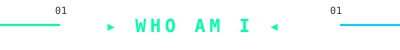
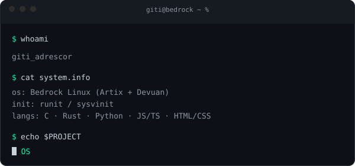
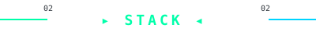
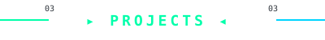
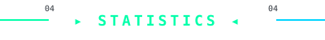
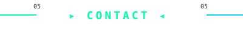

  

 

 

 

 

---

 

 

---

 

<h3>⚙️ Systems</h3>

 

 

 

<h3>🌐 Full Stack</h3>

 

 

 

 

<h3>🐧 OS</h3>

 

 

 

---

 

| Project | Description | Lang |
|:---|:---|:---:|
| **[GValli](https://github.com/AdrescorGiti/GValli)** | CLI package manager aggregator |  |
| **[OpenWire](https://github.com/AdrescorGiti/OpenWire)** | Soundpad & effects for PipeWire |  |
| **[gvalli-repo](https://github.com/AdrescorGiti/gvalli-repo)** | Package repo for GValli |  |
| **G OS** | Operating system — in development |  |

 

---

 

---

 

 

 

 

---

 

